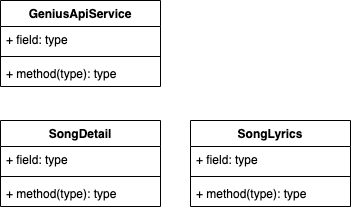

# Genius Api Service

I decided I wanted to build an API that would analyze the lyrics of my favorite artist, and look for patterns in their songs.

Things I plan on looking at is :

* How many unique words / extent of vocabulary
* Grade level of vocabulary
* Repetition of phrases
* (more)

The technologies i plan on using to implement this are :

* Spring Boot

This is the first version of my UML

